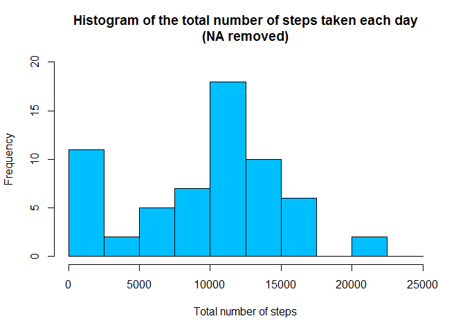
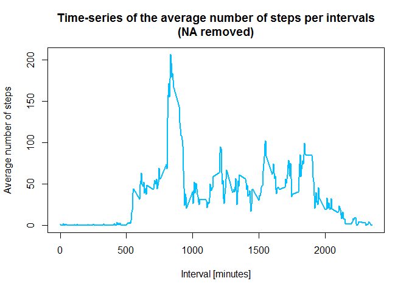
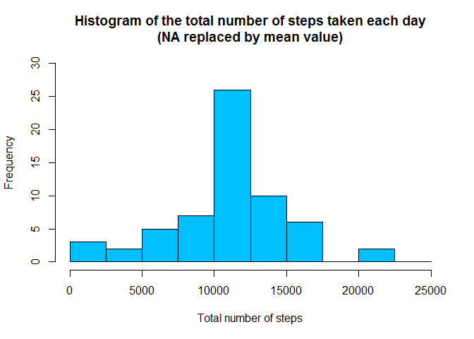

# Reproducible Research: Peer Assessment 1  


## Loading and preprocessing the data

```r
activity_data_r <- read.csv("activity.csv", stringsAsFactors=FALSE)
activity_data_r$date <- as.POSIXct(activity_data_r$date, format="%Y-%m-%d")

activity_data_r <- data.frame(date=activity_data_r$date, 
                           weekday=tolower(weekdays(activity_data_r$date)), 
                           steps=activity_data_r$steps, 
                           interval=activity_data_r$interval)

# Compute the day type (weekend or weekday)
activity_data_r <- cbind(activity_data_r, 
                      daytype=ifelse(activity_data_r$weekday == "saturday" | 
                                     activity_data_r$weekday == "sunday", "weekend", 
                                     "weekday"))

# Create the final data.frame
activity_data <- data.frame(date=activity_data_r$date, 
                       weekday=activity_data_r$weekday, 
                       daytype=activity_data_r$daytype, 
                       interval=activity_data_r$interval,
                       steps=activity_data_r$steps)
```

## What is mean total number of steps taken per day?

```r
# Compute the total number of steps each day (NA values removed)
sum_data <- aggregate(activity_data$steps, by=list(activity_data$date), FUN=sum, na.rm=TRUE)

# Rename the attributes
names(sum_data) <- c("date", "total")
# Compute the histogram of the total number of steps each day
hist(sum_data$total, 
     breaks=seq(from=0, to=25000, by=2500),
     col="deepskyblue", 
     xlab="Total number of steps", 
     ylim=c(0, 20), 
     main="Histogram of the total number of steps taken each day\n(NA removed)")
```

 

```r
mean(sum_data$total, na.rm=TRUE)
```

```
## [1] 9354.23
```

```r
median(sum_data$total, na.rm=TRUE)
```

```
## [1] 10395
```

## What is the average daily activity_data pattern?

```r
# Compute the means of steps accross all days for each interval
mean_data <- aggregate(activity_data$steps, 
                       by=list(activity_data$interval), 
                       FUN=mean, 
                       na.rm=TRUE)

# Rename the attributes
names(mean_data) <- c("interval", "mean")

# Compute the time series plot
plot(mean_data$interval, 
     mean_data$mean, 
     type="l", 
     col="deepskyblue", 
     lwd=2, 
     xlab="Interval [minutes]", 
     ylab="Average number of steps", 
     main="Time-series of the average number of steps per intervals\n(NA removed)")
```

 

On average across all the days in the dataset, the 5-minute interval contains
the maximum number of how many steps?

```r
# We find the position of the maximum mean
max_pos <- which(mean_data$mean == max(mean_data$mean))

# We lookup the value of interval at this position
max_interval <- mean_data[max_pos, 1]
```
The 5-minute interval that contains the maximum of steps, on average across all days, is 835.


## Inputing missing values

There are many days/intervals where there are missing values (coded as `NA`). The presence of missing days may introduce bias into some calculations or summaries of the data.

Calculate and report the total number of missing values in the dataset (i.e. the total number of rows with NA's)


```r
# Clear the workspace
rm(max_interval)

# We use the trick that a TRUE boolean value is equivalent to 1 and a FALSE to 0.
NA_count <- sum(is.na(activity_data$steps))
```

The number of NA's is 2304.

Devise a strategy for filling in all of the missing values in the dataset. The strategy does not need to be sophisticated. For example, you could use the mean/median for that day, or the mean for that 5-minute interval, etc.


```r
# Find the NA positions
na_pos <- which(is.na(activity_data$steps))

# Create a vector of means
mean_vector <- rep(mean(activity_data$steps, na.rm=TRUE), times=length(na_pos))
```

We use the strategy to remplace each NA value by the mean of the steps attribute.

Create a new dataset that is equal to the original dataset but with the missing data filled in.


```r
# Replace the NAs by the means
activity_data[na_pos, "steps"] <- mean_vector

# Clear the workspace
rm(mean_vector, na_pos)
```
Make a histogram of the total number of steps taken each day and calculate and report the mean and median total number of steps taken per day. Do these values differ from the estimates from the first part of the assignment? What is the impact of imputing missing data on the estimates of the total daily number of steps?


```r
# Compute the total number of steps each day (NA values removed)
total_data <- aggregate(activity_data$steps, by=list(activity_data$date), FUN=sum)

# Rename the attributes
names(total_data) <- c("date", "total")

# Compute the histogram of the total number of steps each day
hist(total_data$total, 
     breaks=seq(from=0, to=25000, by=2500),
     col="deepskyblue", 
     xlab="Total number of steps", 
     ylim=c(0, 30), 
     main="Histogram of the total number of steps taken each day\n(NA replaced by mean value)")
```

 

###The mean and median are computed:


```r
mean(sum_data$total)
```

```
## [1] 9354.23
```

```r
median(sum_data$total)
```

```
## [1] 10395
```
These formulas gives a mean and median of 9354.2295082 and 10395.

These values differ greatly from the estimates from the first part of the assignment. The impact of inputing the missing values is to have more data, hence to obtain a bigger mean and median value.

Are there differences in activity_data patterns between weekdays and weekends?
For this part the weekdays() function may be of some help here. Use the dataset with the filled-in missing values for this part.

Create a new factor variable in the dataset with two levels - "weekdays" and "weekend" indicating whether a given date is a weekday or weekend day.


```r
# The new factor variable "daytype" was already in the activity_data data frame
head(activity_data)
```

```
##         date weekday daytype interval   steps
## 1 2012-10-01  monday weekday        0 37.3826
## 2 2012-10-01  monday weekday        5 37.3826
## 3 2012-10-01  monday weekday       10 37.3826
## 4 2012-10-01  monday weekday       15 37.3826
## 5 2012-10-01  monday weekday       20 37.3826
## 6 2012-10-01  monday weekday       25 37.3826
```

Make a panel plot containing a time series plot (i.e. type = "l") of the 5- minute interval (x-axis) and the average number of steps taken, averaged across all weekday days or weekend days (y-axis).


```r
# Clear the workspace
rm(sum_data)

# Load the lattice graphical library
library(lattice)

# Compute the average number of steps taken, averaged across all daytype variable
mean_data <- aggregate(activity_data$steps, 
                       by=list(activity_data$daytype, 
                               activity_data$weekday, activity_data$interval), mean)

# Rename the attributes
names(mean_data) <- c("daytype", "weekday", "interval", "mean")
```

The time series plot:


```r
# Compute the time serie plot
xyplot(mean ~ interval | daytype, mean_data, 
       type="l", 
       lwd=1, 
       xlab="Interval", 
       ylab="Number of steps", 
       layout=c(1,2))
```

 
